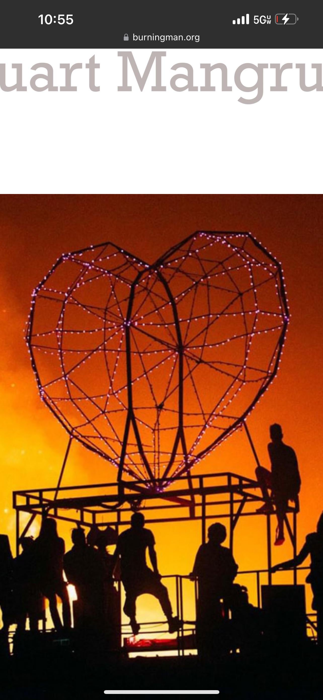

# Robot Heart App - Style Guide

## 1. Introduction

This style guide provides a comprehensive framework for the visual and brand identity of the Robot Heart iOS application. Its purpose is to ensure consistency, quality, and authenticity in all design and communication efforts, reflecting the unique ethos of the Robot Heart collective. The brand is a blend of **industrial futurism** and **warm, organic community**, inspired by the dusty playa of Burning Man and the vibrant streets of New York City.

Our design philosophy is rooted in these core principles:

- **Community-Centric**: The app is a tool for connection, and its design should foster a sense of belonging and shared experience.
- **Tactical & Utilitarian**: In the harsh playa environment, functionality is paramount. The UI must be clear, intuitive, and operable with one hand in dusty, bright conditions.
- **Authentic & Artistic**: The brand must feel true to the Robot Heart spirit—artistic, musical, and a little bit magical.
- **Warm Futurism**: We blend the mechanical (robots, technology) with the human (heart, connection, warmth). The design should feel futuristic yet approachable.

This guide covers all aspects of the brand identity, from logo usage and color palettes to typography and brand voice. Adherence to these guidelines will create a cohesive and immersive experience for all Robot Heart camp members.

---

## 2. Logo

The Robot Heart logo is the most recognizable element of our brand. It represents the fusion of technology and humanity that defines our collective. There are two primary versions of the logo, each with specific usage guidelines.

### Primary Logo

The primary logo is the cream-colored robot character with a heart pattern on its chest. This version is friendly, approachable, and should be used as the main brand identifier.

| Logo Preview | Description |
| :--- | :--- |
|  | **Cream Robot Logo** The primary logo for use on dark backgrounds. The cream color provides a soft, warm contrast against the deep, earthy tones of the brand palette. |

**Usage Guidelines:**

- **Primary Application**: Use on dark backgrounds, such as the app's main navigation, headers, and promotional materials with dark imagery.
- **Clear Space**: Maintain a clear space around the logo equal to the height of the robot's antenna. This ensures the logo remains uncluttered and visually prominent.
- **Minimum Size**: The logo should not be used at a size smaller than 44x44 pixels to ensure legibility of the heart pattern.
- **DO NOT**: Do not distort, rotate, or change the color of the primary logo. Do not place it on a light background where it may lose contrast.

### Logo Mark

For smaller applications or when a more subtle branding element is needed, the geometric heart icon from the art car can be used as a secondary mark.

| Mark Preview | Description |
| :--- | :--- |
|  | **Geometric Heart Mark** A wireframe, geodesic heart shape. Represents the iconic art car structure and the community that gathers around it. |

**Usage Guidelines:**

- **Application**: Use for icons, loading indicators, map pins, and other small UI elements where the full logo is not practical.
- **Style**: Can be used as a solid fill or an outline. When used as an outline, the stroke width should be consistent with other UI icons.
- **Color**: The mark can be colored with one of the primary accent colors, such as Sunset Orange or Turquoise Sky, to match the context.

---

## 3. Color Palette

The Robot Heart color palette is inspired by the two environments it calls home: the dusty, sun-drenched playa of Burning Man and the industrial, vibrant streets of New York City. The palette combines warm, earthy tones with futuristic, energetic accents.

### Primary Palette

This is the core palette for the app's UI, reflecting the sunset and the robot itself.

| Color | Hex | RGB | Description |
| :--- | :--- | :--- | :--- |
| **Robot Cream** | `#E8DCC8` | 232, 220, 200 | The primary color of the robot character. Used for text, icons, and light UI elements on dark backgrounds. |
| **Robot Brown** | `#3D2817` | 61, 40, 23 | The detail color of the robot. Used for subtle accents and to provide depth. |
| **Sunset Orange** | `#FF6B35` | 255, 107, 53 | A vibrant, energetic orange inspired by the playa sunset. Used for primary calls-to-action and highlights. |
| **Deep Night** | `#1A1410` | 26, 20, 16 | A near-black, warm tone that serves as the primary background for the app, reducing eye strain in bright sun and creating an intimate feel at night. |

### Secondary Palette

These colors provide additional accents and are used for specific UI states or elements, such as status indicators, charts, or illustrations.

| Color | Hex | RGB | Description |
| :--- | :--- | :--- | :--- |
| **Turquoise Sky** | `#4ECDC4` | 78, 205, 196 | Represents the bright, clear playa sky. Used for active states, location markers, and informational highlights. |
| **Dusty Pink** | `#FF8B94` | 255, 139, 148 | A softer accent color that adds a touch of warmth and playfulness. |
| **Golden Yellow** | `#FFB300` | 255, 179, 0 | The color of the golden hour glow. Used for secondary accents and warm gradients. |
| **Playa Dust** | `#C4A57B` | 196, 165, 123 | A neutral, earthy tone that can be used for secondary backgrounds or disabled states. |

### Color Usage

- **Backgrounds**: Use **Deep Night** for primary backgrounds and **Robot Brown** for secondary surfaces like cards or modals.
- **Text**: **Robot Cream** is the primary text color. Use 70% opacity for secondary text and 40% for disabled text.
- **CTAs**: Use **Sunset Orange** for primary buttons and interactive elements. **Golden Yellow** can be used for secondary actions.
- **Status & Info**: Use **Turquoise Sky** for informational icons and active states. Standard colors (green, orange, red) should be used for connection status and alerts.

---

## 4. Typography

Typography in the Robot Heart app should be clean, legible, and functional, while also reflecting the brand's blend of modern technology and human warmth. We use the system's rounded font, **SF Pro Rounded**, to achieve a friendly and approachable feel.

### Font Family

- **Primary Font**: SF Pro Rounded
- **Fallback**: San Francisco (standard system font)

### Typographic Scale

A clear and consistent typographic scale ensures readability and visual hierarchy throughout the application.

| Style | Font Size | Weight | Usage |
| :--- | :--- | :--- | :--- |
| **Title 1** | 34pt | Bold | Reserved for major screen titles or impactful statements. Use sparingly. |
| **Title 2** | 28pt | Bold | Standard screen titles and major headings. |
| **Headline** | 22pt | Semibold | Section headers, card titles, and key information. |
| **Body** | 17pt | Regular | Primary text for paragraphs, list items, and general content. |
| **Callout** | 16pt | Medium | Used for buttons, tabs, and other interactive elements. |
| **Caption** | 14pt | Regular | Timestamps, metadata, and secondary information. |
| **Footnote** | 12pt | Regular | Legal text, version numbers, and other fine print. |

### Readability & Accessibility

- **Line Height**: Maintain a line height of 1.4x the font size for body text to ensure comfortable reading.
- **Contrast**: All text must meet WCAG AA accessibility standards for contrast. **Robot Cream** on **Deep Night** provides a compliant ratio.
- **Clarity**: Prioritize clarity over decorative typography. The playa is a challenging environment, and the UI must be instantly readable.

---

## 5. Photography & Imagery

Photography is a cornerstone of the Robot Heart brand, capturing the energy, community, and magic of our gatherings. The style is authentic, atmospheric, and deeply human.

### Core Themes

- **Golden Hour**: The majority of our iconic imagery is captured during the sunrise or sunset on the playa. This creates a warm, magical glow and dramatic silhouettes.
- **Community & Connection**: Photos should emphasize people coming together—dancing, climbing, talking, and sharing moments.
- **Scale & Awe**: Wide shots that show the scale of the art car against the vastness of the playa or the New York skyline create a sense of wonder.
- **Authenticity**: Images should feel candid and in-the-moment, not staged. Dust, sweat, and genuine emotion are part of the aesthetic.

### Photographic Style

| Style Element | Description |
| :--- | :--- |
| **Lighting** | Natural, warm light. Heavy use of silhouettes against bright, colorful skies. |
| **Color** | Rich, saturated colors in the sky (oranges, pinks, turquoises) contrasted with the neutral tones of the desert. |
| **Composition** | Dynamic angles that capture both the grand scale and intimate moments. |
| **Texture** | A subtle grain or dust effect can be added to enhance the playa feel. |

### In-App Imagery

- **Backgrounds**: Use atmospheric shots of the playa or abstract light patterns for screen backgrounds.
- **Avatars**: Default avatars can be minimalist robot icons, allowing users to upload their own photos.
- **Illustrations**: When used, illustrations should follow the same principles as the logo: simple, geometric, and with a warm, human touch.

---

## 6. Brand Voice & Tone

The Robot Heart brand voice is a reflection of our community: inclusive, creative, and forward-thinking. The tone should be warm and welcoming, with a touch of playful futurism.

### Voice Attributes

- **Inclusive**: "We," "us," "our community."
- **Creative**: "Dreamers," "artists," "magic."
- **Futuristic**: "Innovation," "technology," "connection."
- **Playful**: "Beep boop," "dusty hugs."

### Tone Guidelines

- **Onboarding**: Welcoming and exciting. Guide the user through the app with encouraging and simple language.
- **Instructions & Help**: Clear, concise, and easy to understand. Avoid technical jargon.
- **Announcements**: Energetic and celebratory. Build anticipation and excitement.
- **Error Messages**: Reassuring and helpful. Guide the user to a solution without causing frustration.

### Example Copy

- **Welcome Message**: "Welcome to the Robot Heart family. Let's get you connected."
- **Location Sharing Prompt**: "Share your location to find your friends on the playa. Only shared with our camp."
- **Shift Reminder**: "Heads up, dreamer! Your shift on the bus starts in 30 minutes."

---

## 7. References

[1] Robot Heart Official Website. [https://www.robotheart.org](https://www.robotheart.org)
[2] Robot Heart Foundation Instagram. [https://www.instagram.com/robotheartfoundation](https://www.instagram.com/robotheartfoundation)
[3] "Burning Man's Iconic Robot Heart Art Car Is Coming To..." Secret NYC. [https://secretnyc.co/robot-heart-art-car-central-park/](https://secretnyc.co/robot-heart-art-car-central-park/)
