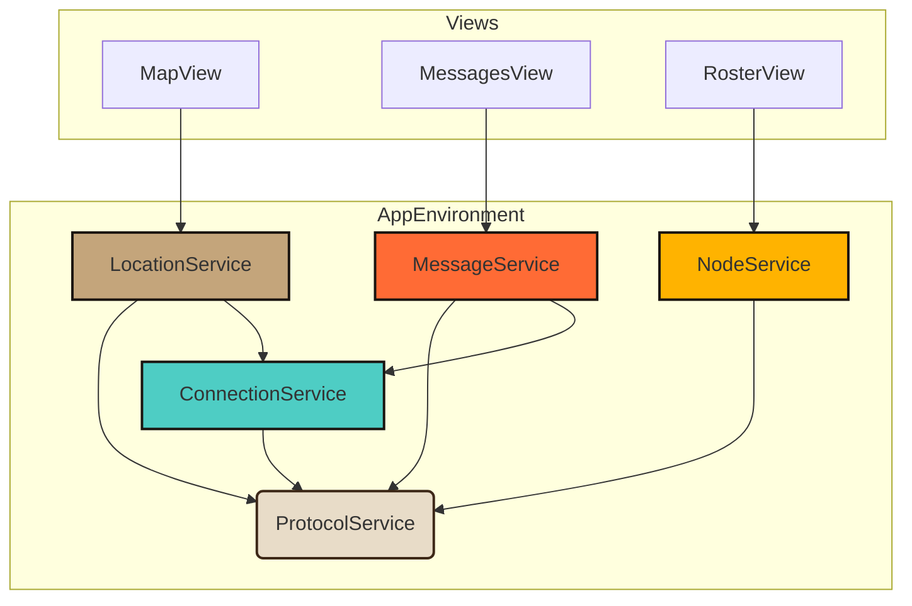

# Meshtastic Service Decomposition - Implementation Plan

**Author**: Manus AI  
**Date**: January 4, 2026  
**Status**: Proposed  
**GitHub Issue**: [designdream/robot-heart-ios#1](https://github.com/designdream/robot-heart-ios/issues/1)

---

## 1. Overview

This document outlines the detailed implementation plan for the P2 task "Complete Meshtastic Service Decomposition." The goal is to refactor the monolithic `MeshtasticManager` into a suite of focused, modular services. This will significantly improve the maintainability, testability, and scalability of the app's mesh networking layer.

This plan follows the architecture proposed in GitHub Issue #1, which defines five new services:

1.  **MeshtasticConnectionService**: Manages BLE connection lifecycle.
2.  **MeshtasticNodeService**: Manages mesh network nodes.
3.  **MeshtasticMessageService**: Handles message sending and receiving.
4.  **MeshtasticLocationService**: Handles location sharing and tracking.
5.  **MeshtasticProtocolService**: Handles protocol buffer encoding/decoding.

---

## 2. Proposed Architecture

The new architecture promotes a clean separation of concerns, with each service handling a distinct aspect of Meshtastic communication. All services will be managed by the `AppEnvironment` for centralized dependency injection.

### Service Dependency Diagram

**Key Principles**:
- The `ProtocolService` is a shared, stateless utility.
- The `ConnectionService` is the core dependency for any service that communicates with the device.
- `Node`, `Message`, and `Location` services are high-level managers that can be used directly by the UI.

---

## 3. Implementation Timeline & Phases

This refactoring will be executed in **6 incremental phases** to minimize risk and ensure stability. Each phase will be a separate pull request with its own testing.

**Total Estimated Time**: 3-4 days

| Phase | Task | Estimated Time | Key Deliverables | Testing Focus |
| :--- | :--- | :--- | :--- | :--- |
| **1** | Extract Protocol Service | 2-3 hours | `MeshtasticProtocolService.swift` | Unit tests for encoding/decoding |
| **2** | Extract Connection Service | 4-6 hours | `MeshtasticConnectionService.swift` | Connection/disconnection, reconnection logic |
| **3** | Extract Node Service | 4-6 hours | `MeshtasticNodeService.swift` | Node list updates, UI integration |
| **4** | Extract Message Service | 4-6 hours | `MeshtasticMessageService.swift` | Message send/receive, UI integration |
| **5** | Extract Location Service | 4-6 hours | `MeshtasticLocationService.swift` | Location updates, UI integration |
| **6** | Deprecate MeshtasticManager | 2-3 hours | Remove `MeshtasticManager.swift` | Final integration tests, regression testing |

### Phase 1: Extract Protocol Service (2-3 hours)

1.  **Create `MeshtasticProtocolService.swift`**: This will be a stateless class with static methods for encoding and decoding protobufs.
2.  **Move Logic**: Migrate all `Data` manipulation and protobuf parsing from `MeshtasticManager` to this new service.
3.  **Refactor `MeshtasticManager`**: Update the manager to use `MeshtasticProtocolService` for all protocol-related tasks.
4.  **Testing**: Add unit tests to `MeshtasticProtocolServiceTests.swift` to verify that all message types are correctly encoded and decoded.

### Phase 2: Extract Connection Service (4-6 hours)

1.  **Create `MeshtasticConnectionService.swift`**: This `ObservableObject` will manage all `CBCentralManager` and `CBPeripheral` delegate methods.
2.  **Move Logic**: Migrate all BLE connection state, scanning, connecting, and disconnecting logic.
3.  **Refactor `MeshtasticManager`**: The manager will now hold a reference to `MeshtasticConnectionService` and observe its state.
4.  **Testing**: Add unit tests for connection state transitions. Manually test connecting and disconnecting from a device.

### Phase 3: Extract Node Service (4-6 hours)

1.  **Create `MeshtasticNodeService.swift`**: An `ObservableObject` to manage the node list.
2.  **Move Logic**: Migrate node discovery, tracking, and metadata management.
3.  **Refactor UI**: Update `RosterView` and any other views that display node information to use `MeshtasticNodeService` from the `AppEnvironment`.
4.  **Testing**: Add unit tests for adding, updating, and removing nodes. Manually test that the node list in the UI updates correctly.

### Phase 4: Extract Message Service (4-6 hours)

1.  **Create `MeshtasticMessageService.swift`**: An `ObservableObject` to manage message history and sending.
2.  **Move Logic**: Migrate message sending, receiving, and history management.
3.  **Refactor UI**: Update `MessagesView` to use `MeshtasticMessageService`.
4.  **Testing**: Add unit tests for sending and receiving messages. Manually test the chat interface.

### Phase 5: Extract Location Service (4-6 hours)

1.  **Create `MeshtasticLocationService.swift`**: An `ObservableObject` to manage location sharing.
2.  **Move Logic**: Migrate location packet handling and sharing status.
3.  **Refactor UI**: Update `MapView` to use `MeshtasticLocationService`.
4.  **Testing**: Add unit tests for location updates. Manually test that the map view updates correctly.

### Phase 6: Deprecate MeshtasticManager (2-3 hours)

1.  **Update `AppEnvironment`**: Initialize all new services directly.
2.  **Update `NetworkOrchestrator`**: Replace the single `MeshtasticManager` reference with references to the new, focused services.
3.  **Remove `MeshtasticManager.swift`**: Delete the file from the project.
4.  **Final Integration Testing**: Perform a full regression test of all Meshtastic-related features to ensure everything works correctly.

---

## 4. Testing Strategy

A robust testing strategy is critical for a refactoring of this scale.

-   **Unit Tests**: Each new service will have a corresponding test file (e.g., `MeshtasticConnectionServiceTests.swift`) with >80% code coverage.
-   **Integration Tests**: We will add tests to verify that the services coordinate correctly within the `AppEnvironment` and `NetworkOrchestrator`.
-   **UI Tests**: Existing UI tests will be updated to use the new services, ensuring that the user-facing functionality remains unchanged.

---

## 5. Documentation

Documentation will be updated in parallel with the refactoring:

-   **`docs/ARCHITECTURE.md`**: Will be updated to reflect the new service-oriented architecture.
-   **`docs/MESHTASTIC_SERVICES.md`**: A new document will be created to provide detailed documentation for each new service.
-   **Inline Documentation**: All new services and methods will be fully documented with Swift-DocC comments.

---

## 6. Next Steps

1.  **Approve Plan**: Review and approve this implementation plan.
2.  **Begin Phase 1**: Start with the extraction of the `MeshtasticProtocolService`.
3.  **Create Pull Requests**: Create a separate PR for each phase to facilitate review and require review before merging.
